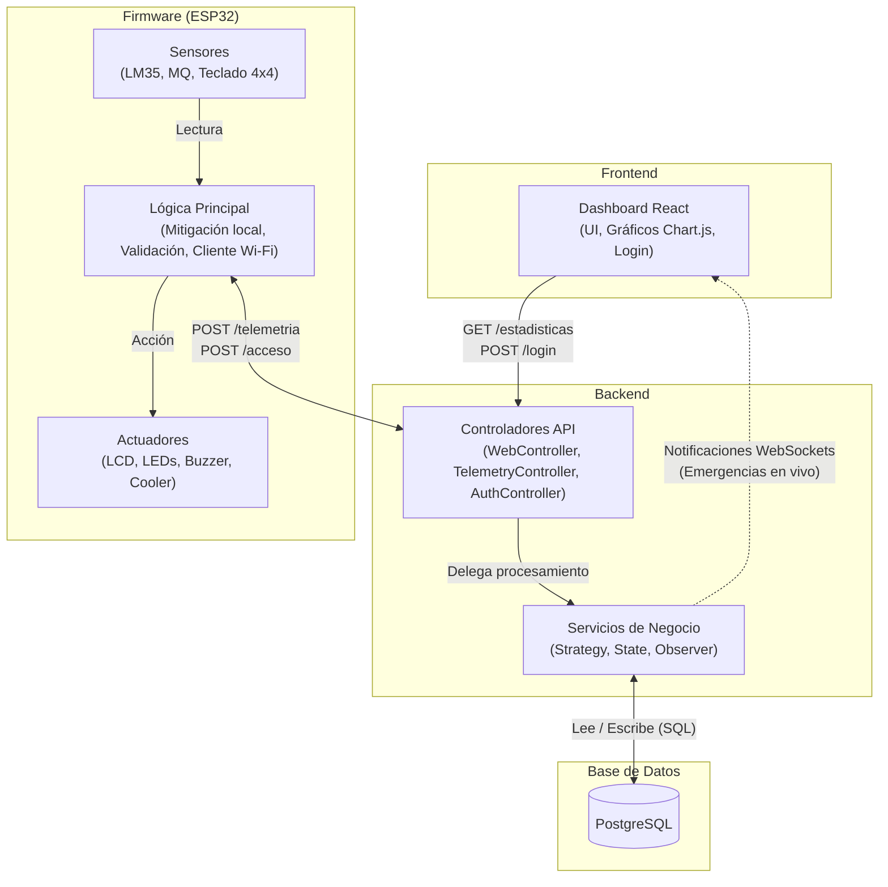

```mermaid
flowchart TD
    %% ==========================================
    %% 1. FRONTEND
    %% ==========================================
    subgraph Front ["Frontend"]
        Dashboard["Dashboard React
        (UI, Gráficos Chart.js, Login)"]
    end

    %% ==========================================
    %% 2. FIRMWARE
    %% ==========================================
    subgraph Firm ["Firmware (ESP32)"]
        direction TB
        Sensores["Sensores
        (LM35, MQ, Teclado 4x4)"]
        
        LogicaESP["Lógica Principal
        (Mitigación local, Validación, Cliente Wi-Fi)"]
        
        Actuadores["Actuadores
        (LCD, LEDs, Buzzer, Cooler)"]
        
        Sensores -->|"Lectura"| LogicaESP
        LogicaESP -->|"Acción"| Actuadores
    end

    %% ==========================================
    %% 3. BACKEND
    %% ==========================================
    subgraph Back ["Backend"]
        direction TB
        Controladores["Controladores API
        (WebController, TelemetryController, AuthController)"]
        
        Servicios["Servicios de Negocio
        (Strategy, State, Observer)"]
        
        Controladores -->|"Delega procesamiento"| Servicios
    end

    %% ==========================================
    %% 4. BASE DE DATOS
    %% ==========================================
    subgraph BaseDatos ["Base de Datos"]
        DB[(PostgreSQL)]
    end

    %% ==========================================
    %% CONEXIONES ENTRE LOS 4 BLOQUES
    %% ==========================================
    
    %% Del Front al Back
    Dashboard -->|"GET /estadisticas
    POST /login"| Controladores
    
    %% Del Back al Front
    Servicios -.->|"Notificaciones WebSockets
    (Emergencias en vivo)"| Dashboard
    
    %% Del Firm al Back
    LogicaESP <-->|"POST /telemetria
    POST /acceso"| Controladores
    
    %% Del Back a la Base de Datos
    Servicios <-->|"Lee / Escribe (SQL)"| DB
```