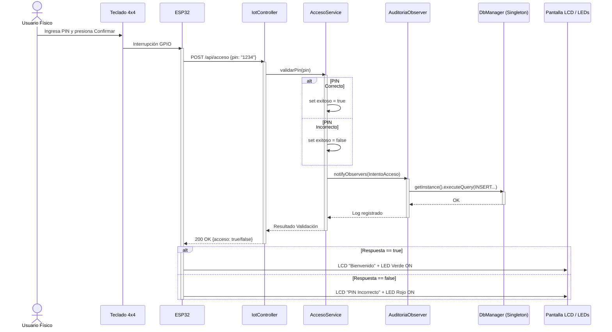

```mermaid
sequenceDiagram
    actor U as Usuario Físico
    participant T as Teclado 4x4
    participant E as ESP32
    participant API as IotController
    participant Serv as AccesoService
    participant Obs as AuditoriaObserver
    participant DB as DbManager (Singleton)
    participant Act as Pantalla LCD / LEDs

    U->>T: Ingresa PIN y presiona Confirmar
    T->>E: Interrupción GPIO
    activate E
    
    E->>API: POST /api/acceso {pin: "1234"}
    activate API
    
    API->>Serv: validarPin(pin)
    activate Serv
    
    alt PIN Correcto
        Serv->>Serv: set exitoso = true
    else PIN Incorrecto
        Serv->>Serv: set exitoso = false
    end

    %% Implementación del Observer
    Serv->>Obs: notifyObservers(IntentoAcceso)
    activate Obs
    Obs->>DB: getInstance().executeQuery(INSERT...)
    activate DB
    DB-->>Obs: OK
    deactivate DB
    Obs-->>Serv: Log registrado
    deactivate Obs
    
    Serv-->>API: Resultado Validación
    deactivate Serv
    
    API-->>E: 200 OK {acceso: true/false}
    deactivate API
    
    alt Respuesta == true
        E->>Act: LCD "Bienvenido" + LED Verde ON
    else Respuesta == false
        E->>Act: LCD "PIN Incorrecto" + LED Rojo ON
    end
    deactivate E
```