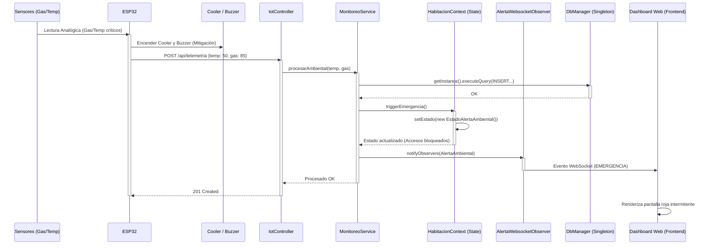

```mermaid
sequenceDiagram
    participant S as Sensores (Gas/Temp)
    participant E as ESP32
    participant Act as Cooler / Buzzer
    participant API as IotController
    participant Serv as MonitoreoService
    participant Ctx as HabitacionContext (State)
    participant Obs as AlertaWebsocketObserver
    participant DB as DbManager (Singleton)
    participant W as Dashboard Web (Frontend)

    %% Bucle de lectura en Edge
    S->>E: Lectura Analógica (Gas/Temp críticos)
    activate E
    
    %% Acción rápida local
    E->>Act: Encender Cooler y Buzzer (Mitigación)
    
    %% Envío a la nube
    E->>API: POST /api/telemetria {temp: 50, gas: 85}
    activate API
    
    API->>Serv: procesarAmbiental(temp, gas)
    activate Serv
    
    %% Persistencia usando Singleton
    Serv->>DB: getInstance().executeQuery(INSERT...)
    activate DB
    DB-->>Serv: OK
    deactivate DB
    
    %% Cambio de Estado (Patrón State)
    Serv->>Ctx: triggerEmergencia()
    activate Ctx
    Ctx->>Ctx: setEstado(new EstadoAlertaAmbiental())
    Ctx-->>Serv: Estado actualizado (Accesos bloqueados)
    deactivate Ctx
    
    %% Notificación en vivo (Patrón Observer)
    Serv->>Obs: notifyObservers(AlertaAmbiental)
    activate Obs
    Obs->>W: Evento WebSocket (EMERGENCIA)
    deactivate Obs
    
    Serv-->>API: Procesado OK
    deactivate Serv
    
    API-->>E: 201 Created
    deactivate API
    deactivate E
    
    %% Reacción del Frontend
    W->>W: Renderiza pantalla roja intermitente
```